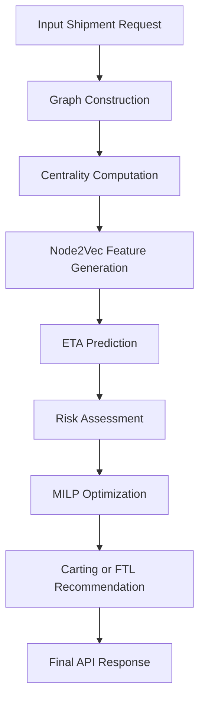

# 🚚 Delhivery Graph Intelligence Core & Prescriptive Dispatch Engine


> Graph Analytics + Machine Learning + Operations Research for intelligent ETA prediction and fleet dispatch optimization.

---

# 📌 Problem Statement

Traditional ETA systems estimate travel time using road distance and traffic conditions. They ignore internal logistics bottlenecks such as:

- Cross-dock congestion
- Sorting center overload
- Yard truck queues
- Hub processing delays
- Delay propagation across the network

This project models the logistics ecosystem as a graph and uses graph intelligence to improve ETA prediction and dispatch decisions.

---

# 🏗 System Architecture


---

# 🔄 End-to-End Workflow



---

# 📸 API Demonstration

## Input Request


```json
{
  "source_facility_id": "IND282001AAA",
  "destination_facility_id": "IND110037AAM",
  "baseline_osrm_time_mins": 180.0,
  "departure_timestamp": "2026-06-02T15:45:00Z",
  "batch_volume_parcels": 650
}
```

---

## Output Response


```json
{
  "graph_corrected_eta_mins": 180,
  "confidence_interval_95": [171, 189],
  "prescriptive_action": "ALLOCATE CARTING (Cost Minimal)",
  "path_vulnerability_score": 0,
  "primary_bottleneck_risk": null
}
```

---

# 📊 Results

| Metric | Value |
|----------|---------|
| ETA Improvement | 14.1% MAE Reduction |
| Graph Representation | Node2Vec |
| ML Model | Random Forest |
| Optimization | MILP |
| Decision Output | Carting vs FTL |

### Performance Visualization

```text
Baseline ETA Error      ████████████████████ 100%
Graph-Aware ETA Error   █████████████████ 85.9%
```

---

# 🛠 Tech Stack

- FastAPI
- Pydantic v2
- NetworkX
- Node2Vec
- Scikit-Learn
- PuLP
- Streamlit
- Docker
- Python 3.12

---

# 📂 Repository Structure

```text
delhivery_graph_api/
│
├── images/
│   ├── api_input.png
│   └── api_output.png
│
├── app/
├── notebooks/
├── frontend.py
├── requirements.txt
├── Dockerfile
└── README.md
```

---

# 🚀 Future Enhancements

- Graph Neural Networks (GNNs)
- Reinforcement Learning Dispatch Policies
- Kafka Streaming
- Digital Twin Simulation
- Multi-Objective Optimization

---

## 👨‍💻 Domains

- Graph Theory
- Machine Learning
- Operations Research
- Backend Development
- Supply Chain Analytics
